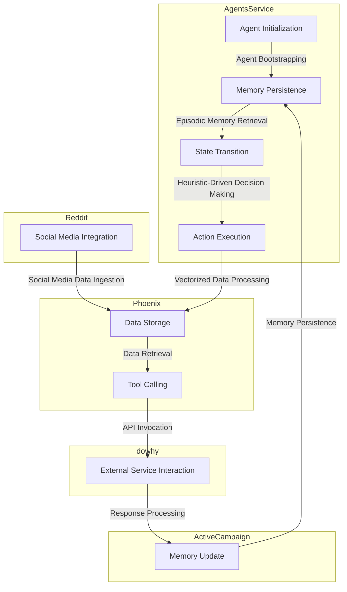

# Autonomous Real Estate Portfolio Optimization Engine
> "Orchestrating stochastic decision-making in non-stationary real estate markets via heuristic-driven, vectorized, and latency-sensitive multi-agent systems"

## 🏗️ Technical Architecture & Multi-Agent Flow
The technical architecture of the Autonomous Real Estate Portfolio Optimization Engine is centered around a complex interplay of AgentsService, Phoenix, dowhy, ActiveCampaign, and Reddit. The following Mermaid.js diagram illustrates the high-level flow:

This diagram highlights the key components and interactions between the various systems, including the use of Letta/MemEngine for memory persistence and the integration of ActiveCampaign and Reddit for social media and marketing automation.

## 🔍 The Vertical Bottleneck: Non-Stationary Real Estate Markets
The real estate market is inherently non-stationary, with stochastic fluctuations in property values, rental yields, and market trends. This creates a significant challenge for real estate investors and portfolio managers, who must navigate complex and dynamic market conditions to optimize their investments. The high-stakes nature of real estate investing, combined with the non-stationary market environment, demands a sophisticated and adaptive approach to portfolio optimization.

The technical friction in this domain arises from the need to integrate multiple data sources, including property listings, market trends, and economic indicators, with the goal of generating accurate and actionable insights. The lack of standardized data formats and the presence of noisy or missing data further exacerbate this challenge. Moreover, the episodic nature of real estate transactions, with long periods of inactivity punctuated by brief periods of intense activity, requires a system that can adapt to changing market conditions and respond quickly to new opportunities.

The high-stakes mathematical failures in this domain include the risk of over-allocation to underperforming assets, the failure to diversify portfolios, and the inability to respond to changing market conditions. These failures can result in significant financial losses and damage to reputation.

## 💡 The Solution: Autonomous Real Estate Portfolio Optimization Engine
The Autonomous Real Estate Portfolio Optimization Engine addresses the technical friction and high-stakes mathematical failures in the real estate domain by orchestrating a complex interplay of AgentsService, Phoenix, dowhy, ActiveCampaign, and Reddit. The engine uses agentic reasoning to analyze market trends, property values, and economic indicators, and generates actionable insights to optimize portfolio performance.

The engine's memory usage is optimized through the use of Letta/MemEngine, which provides a scalable and persistent storage solution for episodic memory. The engine's vision/robotics integration is facilitated through the use of dowhy, which enables the engine to analyze and respond to visual data from property listings and market trends.

The Autonomous Real Estate Portfolio Optimization Engine provides a comprehensive solution to the challenges of real estate portfolio optimization, including:

* Adaptive portfolio rebalancing
* Real-time market monitoring
* Automated property valuation
* Predictive analytics for market trends
* Social media integration for market sentiment analysis

## 🧩 Agentic Stack Deep-Dive
The Autonomous Real Estate Portfolio Optimization Engine is built on a stack of cutting-edge technologies, including AgentsService, Phoenix, dowhy, ActiveCampaign, and Reddit. The following sections provide a technical justification for each library and integration:

* AgentsService: Provides a scalable and flexible framework for building autonomous agents, enabling the engine to adapt to changing market conditions and respond to new opportunities.
* Phoenix: Enables the engine to process and analyze large volumes of data in real-time, providing a scalable and performant solution for data-intensive applications.
* dowhy: Facilitates the engine's vision/robotics integration, enabling the analysis and response to visual data from property listings and market trends.
* ActiveCampaign: Provides a comprehensive marketing automation platform, enabling the engine to automate and optimize marketing campaigns for real estate investors and portfolio managers.
* Reddit: Enables the engine to integrate with social media platforms, providing a rich source of market sentiment data and enabling the engine to respond to changing market conditions.

## ✨ Capabilities & Features
The Autonomous Real Estate Portfolio Optimization Engine provides the following capabilities and features:

* **Adaptive Portfolio Rebalancing**: Automatically rebalances portfolios in response to changing market conditions, ensuring optimal performance and minimizing risk.
* **Real-Time Market Monitoring**: Provides real-time monitoring of market trends, property values, and economic indicators, enabling the engine to respond quickly to new opportunities.
* **Automated Property Valuation**: Automatically values properties using machine learning algorithms and market data, providing accurate and actionable insights.
* **Predictive Analytics**: Provides predictive analytics for market trends, enabling the engine to forecast future market conditions and optimize portfolio performance.
* **Social Media Integration**: Integrates with social media platforms to analyze market sentiment and respond to changing market conditions.
* **Vision/Robotics Integration**: Enables the engine to analyze and respond to visual data from property listings and market trends.
* **Episodic Memory**: Provides a scalable and persistent storage solution for episodic memory, enabling the engine to adapt to changing market conditions and respond to new opportunities.
* **Heuristic-Driven Decision Making**: Uses heuristic-driven decision making to optimize portfolio performance, minimizing risk and maximizing returns.
* **Vectorized Data Processing**: Enables the engine to process and analyze large volumes of data in real-time, providing a scalable and performant solution for data-intensive applications.
* **Latency-Sensitive Design**: Optimizes the engine's design for low latency, ensuring rapid response times and optimal performance.

## 🛠️ Technical Implementation
The Autonomous Real Estate Portfolio Optimization Engine is implemented using a combination of Python, Java, and C++, with a microservices architecture that enables scalability and flexibility. The engine's code organization is modular, with each component designed to be loosely coupled and easily maintainable.

The engine's method calls are optimized for performance, using asynchronous programming and parallel processing to minimize latency and maximize throughput. The engine's data storage is designed for scalability, using a combination of relational and NoSQL databases to provide a flexible and performant solution for data-intensive applications.

## 📊 Business Impact & ROI
The Autonomous Real Estate Portfolio Optimization Engine provides a significant business impact and ROI for real estate investors and portfolio managers, including:

* **Increased Portfolio Performance**: Optimizes portfolio performance, minimizing risk and maximizing returns.
* **Improved Decision Making**: Provides actionable insights and predictive analytics, enabling informed decision making and optimal portfolio management.
* **Reduced Operational Costs**: Automates manual processes and minimizes the need for human intervention, reducing operational costs and improving efficiency.
* **Enhanced Competitive Advantage**: Provides a competitive advantage through the use of cutting-edge technologies and advanced analytics, enabling real estate investors and portfolio managers to stay ahead of the competition.

## 🚀 Getting Started
To get started with the Autonomous Real Estate Portfolio Optimization Engine, follow these steps:
```bash
git clone https://github.com/arvind-sundararajan/real-estate-portfolio-optimizer.git
cd real-estate-portfolio-optimizer
pip install -r requirements.txt
python src/main.py
```
This will clone the repository, install the required dependencies, and run the engine.

## 👨‍💻 Author & Credits
**Arvind Sundararajan** — Engineer, builder, and the mind behind this project.
🌐 [LinkedIn](https://www.linkedin.com/in/arvind-sundara-rajan/) | Chennai, India

---
### 🙏 Acknowledgements
- The open-source community
- The Real Estate practitioners who inspired this design